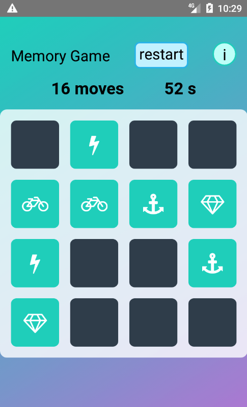

# React Native Memory Game

A memory game mobile app built with React Native, TypeScript and MobX for state management.

Animations and gestures are implemented with Animated, Reanimated2 and PanResponder.

<a href="https://www.youtube.com/watch?v=2ueXk3jBcOY">⚡️ See it in action on YouTube! ⚡️</a>

<a href="https://www.youtube.com/watch?v=2ueXk3jBcOY"></a>

## Web version

This app is the React Native version of a game I already created for the Web using only JavaScript - ie with no frameworks like React or Vue. You can [play the Web version online](https://albert-javascript-udacity-memory-game.netlify.app) and also [view it's source code](https://github.com/AlbertVilaCalvo/JavaScript-Udacity-Memory-Game).

## Develop

First install the dependencies with `yarn install`, then do:

```bash
# Start the bundler
npx react-native start

# Run on Android
npx react-native run-android

# Run on iOS
npx react-native run-ios
```
