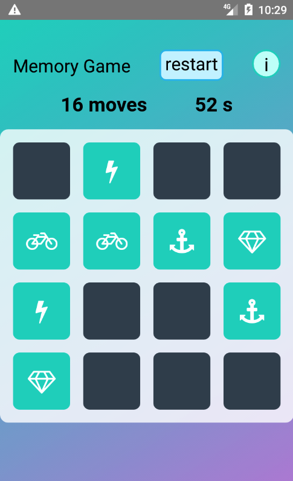

# React Native Memory Game

<a href="https://play.google.com/store/apps/details?id=com.albertvila.memorygame"></a>

A memory game mobile app built with React Native, TypeScript and MobX for state management.

Animations and gestures are implemented with Animated, Reanimated 3 and PanResponder.

<a href="https://www.youtube.com/watch?v=2ueXk3jBcOY">⚡️ See it in action on YouTube! ⚡️</a>

<a href="https://www.youtube.com/watch?v=2ueXk3jBcOY"></a>

## Develop

First install the dependencies with `npm install`, then do:

```bash
# Start the bundler
npx react-native start

# Run on Android
npx react-native run-android

# Run on iOS
npx react-native run-ios
```

## Privacy policy

https://docs.google.com/document/d/e/2PACX-1vQLr1iT4rwvqgwk5oBHBf18JFiSHS7_zzGYbtahTrs3ujEr2vpuOKF2hPJlS9v7S5bcPLsGZFKxUUuK/pub

## Web version

This app is the React Native version of a game I already created for the Web using only JavaScript (ie with no frameworks like React or Vue). You can [play the Web version online here](https://albert-javascript-udacity-memory-game.netlify.app) and also [view its source code here](https://github.com/AlbertVilaCalvo/JavaScript-Udacity-Memory-Game).

## Publish Android app to Google Play

Increment the `versionCode` and change `versionName` in `android/app/build.gradle`.

Open the `android` folder in Android Studio and then do Build → Generate Signed App Bundle/APK...
This generates the `app-release.aab` file in the `android/app/release` directory, which should
be about 26 MB.

Finally, go to the Play Console → Production → Create new release, upload the `.aab` file and
follow the steps until it's live.
