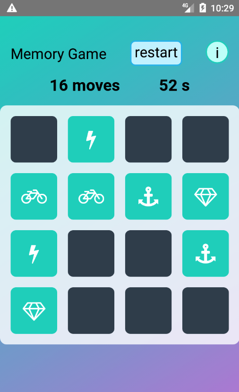

# React Native Memory Game

<a href="https://play.google.com/store/apps/details?id=com.albertvila.memorygame"></a>

A memory game mobile app built with React Native, TypeScript and MobX for state management.

Animations and gestures are implemented with Animated, Reanimated and PanResponder.

<a href="https://www.youtube.com/watch?v=2ueXk3jBcOY">⚡️ See it in action on YouTube! ⚡️</a>

<a href="https://www.youtube.com/watch?v=2ueXk3jBcOY"></a>

## Develop

Make sure you have completed the [Set Up Your Environment](https://reactnative.dev/docs/set-up-your-environment) guide before proceeding.

First install the dependencies with `./manage.sh install`. Then do:

```shell
npm run android
npm run ios
```

To clean the project (i.e. uninstall the dependencies and delete the build folders), run `./manage.sh clean`.

## Privacy policy

https://docs.google.com/document/d/e/2PACX-1vQLr1iT4rwvqgwk5oBHBf18JFiSHS7_zzGYbtahTrs3ujEr2vpuOKF2hPJlS9v7S5bcPLsGZFKxUUuK/pub

## Web version

This app is the React Native version of a game I already created for the Web using only JavaScript (ie with no frameworks like React or Vue). You can [play the Web version online here](https://albert-javascript-udacity-memory-game.netlify.app) and also [view its source code here](https://github.com/AlbertVilaCalvo/JavaScript-Udacity-Memory-Game).

## Publish Android app to Google Play

Increment the `versionCode` and change `versionName` in `android/app/build.gradle`.
Also change the "version" in `package.json` and `package-lock.json`.

Open the `android` folder in Android Studio and then do Build → Generate Signed App Bundle or APK...
Choose Android App Bundle (not APK) and click Next.
Set the upload Key store information and click Next.
Optionally change the Destination Folder (e.g. Downloads). Select the `release` build variant and click Create.
This generates the file `app-release.aab` in the `android/app/release` directory or at the directory you specified (inside a folder `release`).
The `app-release.aab` file should be about 35-45 MB.

Finally, go to the [Google Play Console](https://play.google.com/console) → Select the Memory Game app from the app list → Test and release → Production → Create new release.
Upload the `app-release.aab` file and fill the release notes (you can "Copy from a previous release" and edit the text).
Proceed until it's live with a 100% Roll-out percentage.
Tip: append `?hl=en` to the URL if the console is not in English.
